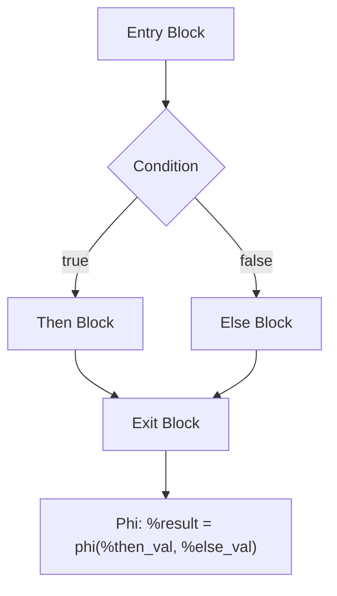
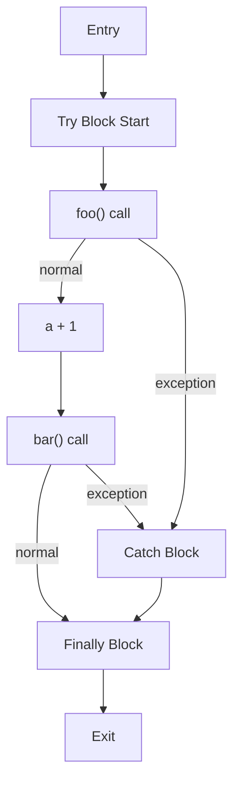

# minify-js design doc

This project is an experimental new approach to JS minification by compiling and optimizing at the IR level rather than AST transformations, for stronger safer optimizations.

## Architecture

The minifier consists of 4 specialized Rust crates that form a compilation pipeline:

- **`parse-js`**: JavaScript parser with comprehensive AST representation supporting full ES2023+ syntax
- **`symbol-js`**: Lexical scoping analysis and symbol resolution with nested scope management
- **`optimize-js`**: Core optimization engine with instruction-based IR and sophisticated compiler algorithms
- **`minify-js`**: Public API orchestrating the pipeline and JavaScript code generation

Functions are compiled in parallel using `crossbeam_utils` for performance, with each function getting its own optimized control flow graph.

## Parse

Convert source JS into AST using a hand-written recursive descent parser. The AST uses a generic `Node<T>` wrapper providing location info, syntax tree, and metadata for every construct. Supports comprehensive JavaScript syntax including JSX, TypeScript annotations, and modern features.

## Symbolize

Track and store definitions and usages of symbols (variables, classes, functions) in a tree of scopes (top level/module, function, block). The system distinguishes between:

- **Local variables**: Declared in current function scope
- **Foreign variables**: From outer scopes (requires special handling)
- **Unknown variables**: Potentially global or undeclared (conservative treatment)
- **Built-in variables**: JavaScript built-ins with known semantics for optimization

## Optimize

Convert to IR and perform optimizations. IR is more regularized, and we can apply more optimizations in a safer simpler manner.

Our goal is minification. The belief is that IR optimization will achieve more than AST transformations. Not all IR optimizations are done. Ones that improve performance but increase code size go against objective, so aren't done.

### Intermediate Representation

Uses a custom instruction-based IR with instruction types like `Bin`, `VarAssign`, `PropAssign`, `CondGoto`, `Call`, `ForeignLoad/Store` for outer scope access, `UnknownLoad/Store` for globals, and `Phi` nodes. Values are SSA variables (%0, %1, %2), constants, built-ins, or function references.

### Process

Functions are compiled individually in parallel. The AST is walked in execution order, emitting a flat instruction stream. This is split into basic blocks forming a CFG, converted to SSA form, then optimized through multiple passes until fixed point convergence.

The optimization passes include dominator-based value numbering for common subexpression elimination and constant propagation, dead code elimination, redundant assignment removal, impossible branch elimination, and CFG pruning. After optimization, SSA is deconstructed and register allocation assigns minimal variable names using interference graphs and liveness analysis.

### Optional Chaining

Optional chaining operators (`?.`) use escape labels for short-circuiting behavior:

```javascript
// Input
obj?.prop?.method()

// Lowered to IR
%0 = load obj
if (%0 == null) goto exit_label
%1 = prop_load %0, "prop"
if (%1 == null) goto exit_label
%2 = prop_load %1, "method"
%3 = call %2()
exit_label:
```

### Built-in Functions

Calls to built-in functions are constant-folded when arguments are known:

| Built-in | Example | Optimized |
|----------|---------|-----------|
| `Math.abs(-5)` | `%0 = call Math.abs, -5` | `%0 = const 5` |
| `Array.isArray([])` | `%0 = call Array.isArray, []` | `%0 = const true` |
| `"hello".length` | `%0 = prop_load "hello", "length"` | `%0 = const 5` |

### Control Flow Example



### Closure Variables

Foreign variable access uses specialized instructions:

```javascript
// Input
function outer() {
  let x = 42;
  return function inner() {
    return x + 1;  // Foreign access
  }
}
```

```
// IR for inner()
%0 = foreign_load x  // Not unknown_load - we know it's from outer scope
%1 = bin_add %0, 1
return %1
```

### Exceptions

Try-catch blocks create control flow edges to catch handlers. Every potentially throwing instruction in a try block has an implicit edge to the catch handler, creating complex CFGs:

```javascript
// Input
try {
  let a = foo();     // can throw
  let b = a + 1;     // safe - no exception edge
  bar(b);            // can throw
} catch (e) {
  handle(e);
} finally {
  cleanup();
}
```



**Throwing vs Non-throwing Operations:**

| Can Throw | Safe |
|-----------|------|
| Function calls | Arithmetic (`+`, `-`, `*`) |
| Property access (`obj.prop`) | Local variable access |
| Array access (`arr[i]`) | Literal values |
| `new` expressions | Assignments to locals |

**Nested Exception Handling:**
```javascript
try {
  try {
    dangerous1();
  } catch (inner) {
    recover();
    dangerous2(); // Can still throw to outer
  }
} catch (outer) {
  fallback();
}
```

Each instruction maps to its nearest enclosing handler. The CFG maintains a stack of active exception contexts during compilation.

**Optimization Constraints:**
- Dead code elimination cannot remove instructions that might throw, even if their results are unused
- Instructions cannot be moved across exception boundaries
- Phi placement must account for exception edges - a variable live before a throwing instruction needs phi nodes in catch blocks
- Constant propagation stops at exception boundaries since execution may not reach later instructions

## Minification

This takes the low-level optimized IR and turns it into minifed JS.

### Reconstruction

Each CFG is transformed back into AST.

### Name minification

For optimal naming of all symbols, each unique name is identified by a distinct integer. The goal is to minimize this set of unique integers needed to represent all symbols in the program, then assign the shortest unique string to each integer by frequency of use. The constraint is that resulting identifiers must not break original code semantics due to clashing in scope.

This is implemented using register allocation algorithms. After optimization, liveness analysis determines variable lifetime ranges. An interference graph is constructed where variables live simultaneously interfere with each other. Graph coloring assigns the minimum number of distinct variable names while respecting JavaScript scoping rules.

**Algorithm:**
1. All foreign vars allocated an integer first, sequentially from zero
2. For each function: map each symbol to next available number, starting from zero, skipping numbers for foreign vars used in the function or inner functions (prevents shadowing)
3. Map number to identifier - static mapping independent of function/context/usage, skipping reserved keywords and used global vars

### Emitting

The AST is walked and JS is emitted in *minimal* form: reduce whitespace, semicolons, etc. as much as possible.
