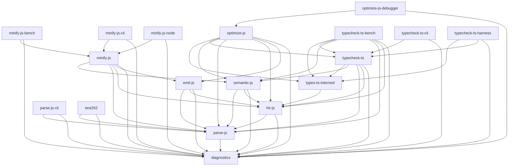

# Workspace dependency graph

_Generated by `scripts/gen_deps_graph.sh`. Do not edit manually._

Run `./scripts/gen_deps_graph.sh` (or `just docs`) to refresh.

Workspace-only edges are shown; third-party dependencies are omitted.
