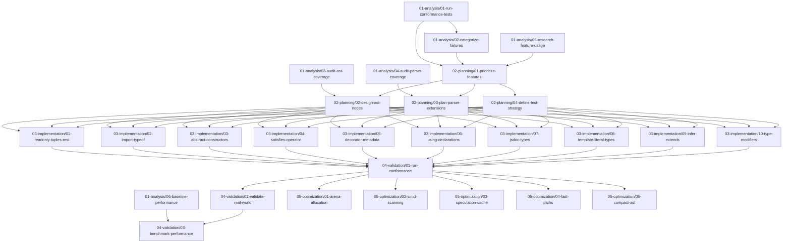

# TypeScript Type Parsing: Task Dependency Graph

This document defines the complete task dependency graph for implementing TypeScript type parsing in ecma-rs. Each task is a self-contained unit that can be executed by an isolated agent.

## Task Graph Visualization



## Parallelization Opportunities

### Phase 1: Analysis (6 tasks in parallel)
All analysis tasks can run simultaneously:
- `01-run-conformance-tests` - Run test suite
- `02-categorize-failures` - Analyze failures (needs test results)
- `03-audit-ast-coverage` - Examine AST structures
- `04-audit-parser-coverage` - Examine parser code
- `05-research-feature-usage` - Survey real-world TypeScript
- `06-baseline-performance` - Benchmark current state

### Phase 2: Planning (4 tasks, mostly sequential)
- `01-prioritize-features` needs analysis results
- Then `02-design-ast-nodes`, `03-plan-parser-extensions`, `04-define-test-strategy` can run in parallel

### Phase 3: Implementation (10 tasks in parallel)
Each feature implementation is independent:
- `01-readonly-tuples-rest`
- `02-import-typeof`
- `03-abstract-constructors`
- `04-satisfies-operator`
- `05-decorator-metadata`
- `06-using-declarations`
- `07-jsdoc-types`
- `08-template-literal-types`
- `09-infer-extends`
- `10-type-modifiers`

### Phase 4: Validation (3 tasks, mostly sequential)
- `01-run-conformance` - Run full test suite
- `02-validate-real-world` - Test on real projects (can start after conformance)
- `03-benchmark-performance` - Compare performance

### Phase 5: Optimization (5 tasks in parallel)
All optimization tasks are independent:
- `01-arena-allocation`
- `02-simd-scanning`
- `03-speculation-cache`
- `04-fast-paths`
- `05-compact-ast`

## Task Metadata Format

Each task file uses this frontmatter structure:

```yaml
---
task_id: "01-analysis/01-run-conformance-tests"
title: "Run TypeScript Conformance Tests"
phase: "analysis"
estimated_duration: "2-4 hours"
complexity: "low"
dependencies: []
inputs: []
outputs:
  - "test-results.json"
  - "test-summary.md"
  - "failures.txt"
skills_required:
  - "Rust development"
  - "Testing"
---
```

## Output Propagation

Each task produces structured outputs that downstream tasks consume:

### Analysis Phase Outputs
- **Test Results**: JSON with pass/fail counts, failure categories
- **AST Coverage Map**: Which TypeScript features have AST nodes
- **Parser Coverage Map**: Which parsing functions exist
- **Feature Frequency**: How often features appear in real code
- **Performance Baseline**: Current parsing speed metrics

### Planning Phase Outputs
- **Prioritized Feature List**: Ordered by importance
- **AST Design Specs**: New node definitions needed
- **Parser Implementation Plans**: Function signatures and logic
- **Test Templates**: Patterns for testing each feature

### Implementation Phase Outputs
- **Code Changes**: Git patches or diffs
- **Test Cases**: New tests added
- **Documentation**: Updated docs
- **Lessons Learned**: Edge cases discovered

### Validation Phase Outputs
- **Conformance Report**: Updated pass rate
- **Real-World Results**: Which projects work/fail
- **Performance Report**: Speed comparisons

### Optimization Phase Outputs
- **Optimized Code**: Performance improvements
- **Benchmark Comparisons**: Before/after metrics
- **Trade-off Analysis**: Memory vs speed decisions

## Execution Instructions

### For Task Orchestrator
1. Start all Phase 1 tasks in parallel
2. When task completes, mark outputs as available
3. When all dependencies satisfied, start next task
4. Collect outputs in shared task workspace

### For Isolated Agents
1. Read your task file completely
2. Read all input files specified in frontmatter
3. Execute task following instructions
4. Write all outputs specified in frontmatter
5. Do NOT communicate with other agents
6. Do NOT assume knowledge from other tasks

## Task Workspace Structure

```
workspace/
  outputs/
    01-analysis/
      01-run-conformance-tests/
        test-results.json
        test-summary.md
        failures.txt
      02-categorize-failures/
        categories.json
        priority-analysis.md
      ... (more task outputs)
    02-planning/
      ... (planning outputs)
    03-implementation/
      ... (implementation outputs)
  shared/
    current-ast-nodes.md (snapshot of existing AST)
    current-parser-functions.md (snapshot of existing parser)
    typescript-spec-links.md (reference documentation)
```

## Quick Start

1. **Setup Workspace**: Create `workspace/outputs/` directories
2. **Run Phase 1**: Execute all 6 analysis tasks in parallel
3. **Aggregate Results**: Collect outputs from Phase 1
4. **Run Phase 2**: Execute planning tasks with Phase 1 outputs
5. **Run Phase 3**: Execute implementation tasks in parallel
6. **Run Phase 4**: Validate results
7. **Run Phase 5**: Optimize in parallel

## Success Criteria

- All tasks complete successfully
- No missing dependencies
- All outputs produced
- Conformance tests pass >95%
- Performance within 20% of oxc

---

**Next**: Read individual task files in `01-analysis/` to begin execution.
